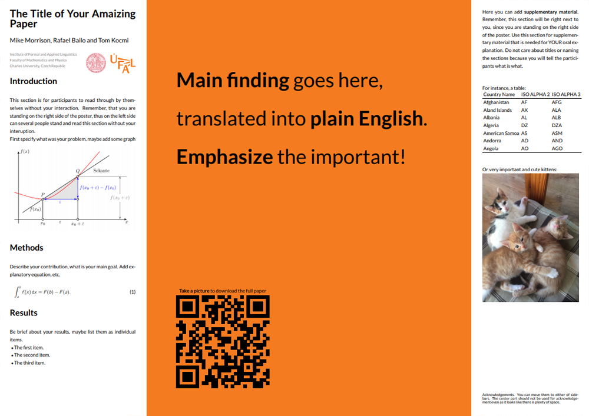

# Better Poster Latex Template

The **Better Poster** is [Mike Morrison](https://twitter.com/mikemorrison)'s response to the traditional academic poster. In his own words:
> Every field in science uses the same, old, wall-of-text poster design. If we can improve the knowledge transfer efficiency of that design even by a little bit, it could have massive ripple effects on all of science.
> 
> Also, poster sessions tend to suck, so here's my pitch to make them more efficient AND more fun with a new approach to designing scientific posters/academic posters that is both more usable, and easier to create!

 - If you want to learn more about the reasons behind the design and how it improves upon more typical academic poster templates, I recommend Mike's [video](https://www.youtube.com/watch?v=1RwJbhkCA58&feature=youtu.be).
 - If you want to see how people are using the Better Poster design, see [#betterposter](https://twitter.com/hashtag/betterposter?src=hash) on twitter.

<kbd>

</kbd>


### Vertical layout

Quickly transform poster to vertical layout by removing `landscape' from documentclass definition

### Class Options

The `betterposter` class accepts three options which change the paper size:
 - `a0paper`, for A0, the default size.
 - `a1paper`, for A1.
 - `a2paper`, for A2.

These options behave like the usual LaTeX class options, for instance:
```
\documentclass[a0paper]{betterposter}
```
#### Other Class Options
The `betterposter` class extends the basic `article` class. Any options you give `betterposter`, other than the ones mentioned above, will be passed directly to `article`. For instance,
```
\documentclass[a0paper,fleqn]{betterposter}
```
will let `betterposter` deal with the `a0paper` option, but will pass `fleqn` directly to `article`.


## Acknowledgements

Mike Morrison - Author of **Better Poster** design

Rafael Bailo - design imported to latex

Tom Kocmi - modified for UFAL purposes, added vertical design


